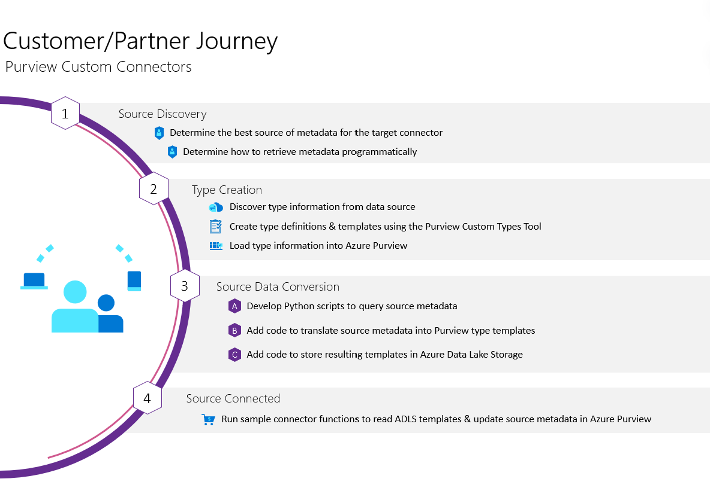

# Microsoft Purview Custom Types Tool
The Purview Custom Types Tool is a solution accelerator for supporting custom connectors in [Microsoft Purview](https://azure.microsoft.com/en-us/services/purview/), which is a unified data governance service that helps you manage and govern your on-premises, multicloud, and software-as-a-service (SaaS) data.

This application supports the following actions:
- Browse existing type definitions
- Create new entity & relationship type definitions
- Create entity templates to simplify source scanning

When combined with the [Purview Custom Connector Solution Accelerator](https://github.com/microsoft/Purview-Custom-Connector-Solution-Accelerator), this application provides entity templates to help create source scanning functionality. The diagram below outlines the typical journey to develop a custom connector for Microsoft Purview:



## Prerequisites

- [Azure subscription](https://azure.microsoft.com/free/)
- [Microsoft Purview](https://azure.microsoft.com/en-us/services/purview/)
- Localhost or Windows 365:
    - [Node.js](https://nodejs.org/)
    - [Azure Function Core Tools](https://docs.microsoft.com/en-us/azure/azure-functions/functions-run-local?tabs=linux,csharp,bash)

## Deployment
This application can be deployed in various ways to meet your needs. Because the creation of type definitions is often limited to a few individuals for a limited time period, this repo is built to run locally by default.

1. [Local PC](#local-setup) - default, ready for local setup below
1. [Windows 365 Cloud PC](https://www.microsoft.com/en-us/windows-365) - securely stream Windows from the Microsoft cloud to any device
1. [Azure](#deploy-to-azure) - using Static Web Apps and Functions


## Local Setup

1. Clone or download this repository and navigate to the project's root directory
1. [Follow these instructions](https://docs.microsoft.com/en-us/azure/purview/tutorial-using-rest-apis#create-a-service-principal-application) to create an application service principal that can access the Microsoft Purview API
1. Rename `/api/local.settings.json.rename` to `local.settings.json` by removing `.rename` extension
1. Edit your `/api/local.settings.json` file:
    * Update `AadTenantId` with your Tenant ID for Azure Active Directory
    * Update `AppClientId` and `AppClientSecret` with your application service principal
    * Update `AtlasAccountName` with your Microsoft Purview account name
    * Update `StorageConnectionString` with your connection string for Azure Data Lake Storage
    * Update `StorageContainer` with your preferred container name
1. Install the application's dependencies:
   ```bash
   npm install
   ```


## Run the App Locally

1. Start the application API from a new terminal:
   ```bash
   cd api
   npm start
   ```
   API now running at [http://localhost:7071/api/aad/token](http://localhost:7071/api/aad/token)

1. Start the application frontend from a second new terminal:
    ```bash
    npm start
    ```
    App now running at [http://localhost:3000/](http://localhost:3000/). Note the `package.json` file has a proxy for port 7071 so you can code directly to the `/api` path on localhost. For more information on the local Azure Functions, see the [API README](./api/).

## Deploy to Azure
Please review the [deployment documentation](./DEPLOY.md) for details. Due to the two methods of [API support in Azure Static Web Apps with Azure Functions](https://docs.microsoft.com/en-us/azure/static-web-apps/apis), you will need to deploy a separate Azure Function for the `/api/AadToken` endpoint.

*Please follow additional best practices for [Securing Azure Functions](https://docs.microsoft.com/en-us/azure/azure-functions/security-concepts) and note the [Security constraints with bringing your own functions to Azure Static Web Apps](https://docs.microsoft.com/en-us/azure/static-web-apps/functions-bring-your-own#security-constraints)*

## Learn More

**Microsoft Purview**
- [Purview Custom Connector Solution Accelerator](https://github.com/microsoft/Purview-Custom-Connector-Solution-Accelerator)
- [Purview Machine Learning Lineage Solution Accelerator](https://github.com/microsoft/Purview-Machine-Learning-Lineage-Solution-Accelerator)
- [Tutorial using the REST APIs](https://docs.microsoft.com/en-us/azure/purview/tutorial-using-rest-apis)

**Azure Static Web Apps**
- [Quickstart for React apps](https://docs.microsoft.com/en-us/azure/static-web-apps/getting-started?tabs=react#create-a-static-web-app)
- [Authentication and authorization](https://docs.microsoft.com/en-us/azure/static-web-apps/authentication-authorization)
- [API support with Azure Functions](https://docs.microsoft.com/en-us/azure/static-web-apps/apis)
- [Getting started with Azure Functions](https://docs.microsoft.com/en-us/azure/azure-functions/functions-get-started?pivots=programming-language-javascript)


## Contributing

This project welcomes contributions and suggestions.  Most contributions require you to agree to a
Contributor License Agreement (CLA) declaring that you have the right to, and actually do, grant us
the rights to use your contribution. For details, visit https://cla.opensource.microsoft.com.

When you submit a pull request, a CLA bot will automatically determine whether you need to provide
a CLA and decorate the PR appropriately (e.g., status check, comment). Simply follow the instructions
provided by the bot. You will only need to do this once across all repos using our CLA.

This project has adopted the [Microsoft Open Source Code of Conduct](https://opensource.microsoft.com/codeofconduct/).
For more information see the [Code of Conduct FAQ](https://opensource.microsoft.com/codeofconduct/faq/) or
contact [opencode@microsoft.com](mailto:opencode@microsoft.com) with any additional questions or comments.


## Trademarks

This project may contain trademarks or logos for projects, products, or services. Authorized use of Microsoft 
trademarks or logos is subject to and must follow 
[Microsoft's Trademark & Brand Guidelines](https://www.microsoft.com/en-us/legal/intellectualproperty/trademarks/usage/general).
Use of Microsoft trademarks or logos in modified versions of this project must not cause confusion or imply Microsoft sponsorship.
Any use of third-party trademarks or logos are subject to those third-party's policies.
